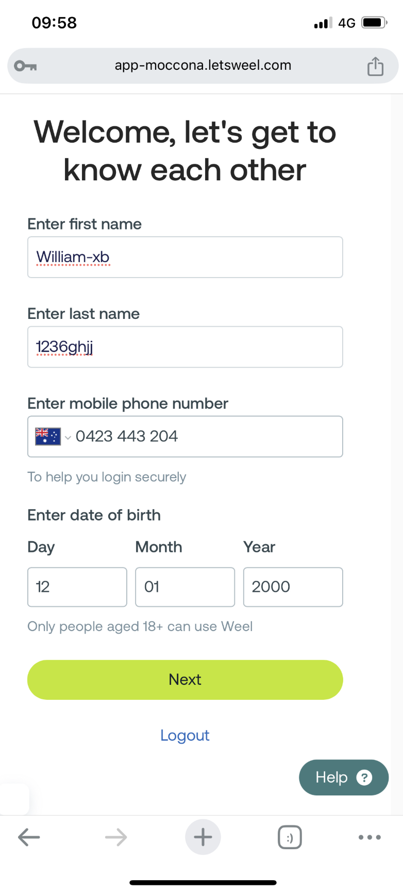
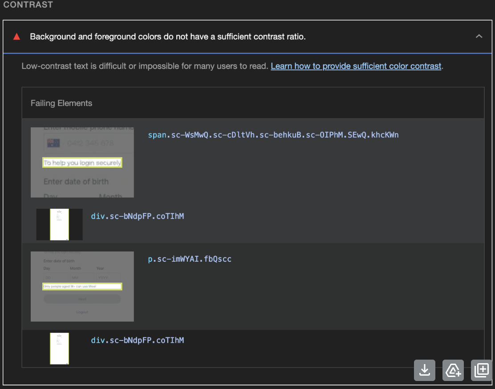
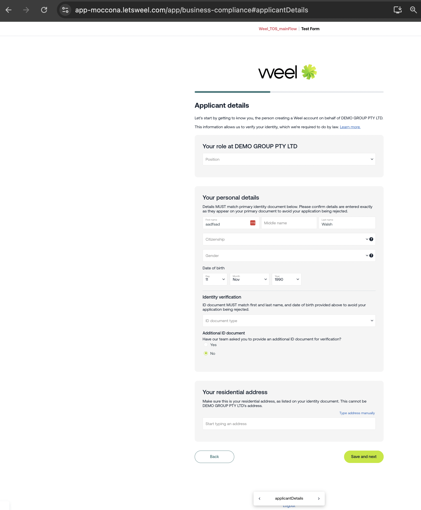
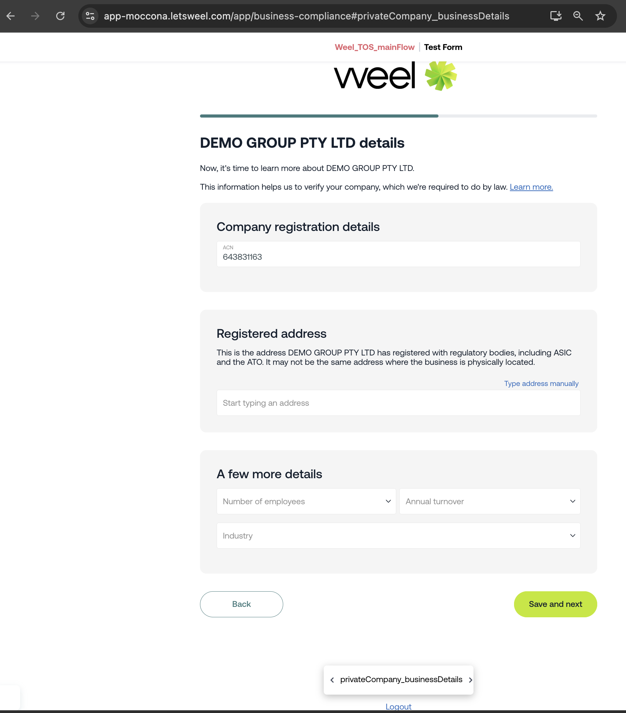
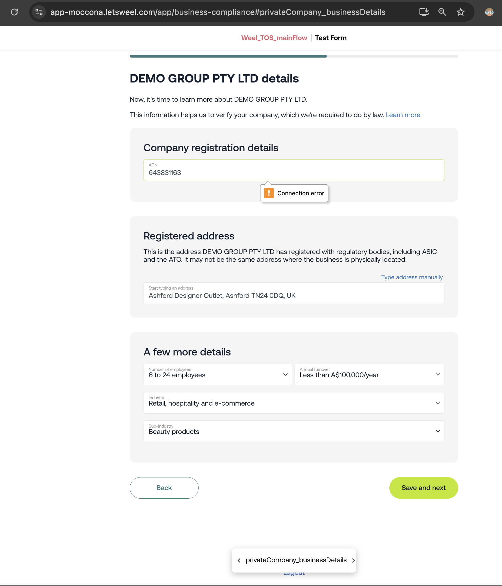

App uses cognito to authenticate and authorize users.

https://app-moccona.letsweel.com/app/business-compliance
https://app-moccona.letsweel.com/app/business-compliance#landingPage

https://app-moccona.letsweel.com/app/business-compliance#applicantDetails

https://app-moccona.letsweel.com/app/business-compliance#privateCompany_businessDetails

Connection error??

